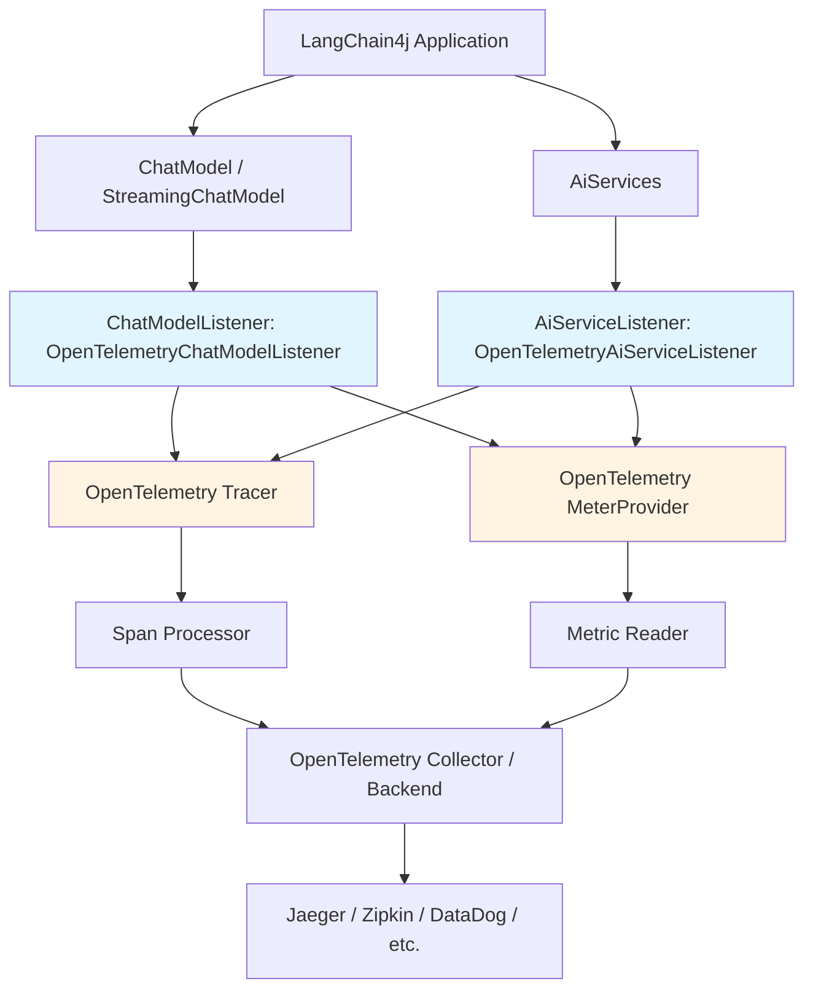

# OpenTelemetry for LangChain4j - Product Requirements Document

## Executive Summary

### Problem Statement
LangChain4j applications currently lack standardized, industry-standard observability for LLM operations. While the framework provides custom observability hooks (`ChatModelListener` and `AiServiceListener`), there is no out-of-the-box integration with OpenTelemetry (OTel), the CNCF standard for distributed tracing, metrics, and logging. This forces teams to:
- Build custom instrumentation from scratch
- Maintain proprietary observability solutions
- Miss correlation with broader application traces
- Lack visibility into LLM costs, latency, and usage patterns

### Proposed Solution
Provide a native OpenTelemetry integration module (`langchain4j-opentelemetry`) that automatically instruments LangChain4j operations following the [OpenTelemetry Semantic Conventions for Generative AI](https://opentelemetry.io/docs/specs/semconv/gen-ai/). The integration will leverage existing observability hooks to emit traces, metrics, and logs compatible with standard OTel collectors and backends (Jaeger, Prometheus, Grafana, DataDog, etc.).

### Expected Impact
- **Developer Experience**: Zero-code or minimal-config observability for LangChain4j applications
- **Standardization**: Align with industry-standard OTel semantic conventions for GenAI
- **Operational Visibility**: Enable teams to monitor LLM performance, costs, errors, and usage
- **Ecosystem Integration**: Work seamlessly with existing OTel infrastructure and tooling
- **Production Readiness**: Support enterprise observability requirements (distributed tracing, SLOs, alerting)

### Success Metrics
- **Adoption**: Module downloads and integration by LangChain4j users
- **Completeness**: Coverage of all `ChatModel`, `StreamingChatModel`, and `AiService` operations
- **Performance**: < 1% overhead on LLM request latency
- **Compatibility**: Verified integration with major OTel backends (Jaeger, Prometheus, Grafana, DataDog)
- **Documentation**: Clear setup guides with Spring Boot, Quarkus, and plain Java examples

---

## Requirements & Scope

### Functional Requirements

**REQ-1: Automatic Trace Generation**
The module shall automatically generate OpenTelemetry spans for all LLM interactions, including:
- Chat model requests (both synchronous and streaming)
- AI Service method invocations
- Tool/function executions
- Guardrail validations (input/output)
- Embedding operations (if supported)

**REQ-2: Semantic Convention Compliance**
The module shall follow the [OpenTelemetry Semantic Conventions for Generative AI](https://opentelemetry.io/docs/specs/semconv/gen-ai/) for all span attributes, including:
- `gen_ai.system` (e.g., "openai", "anthropic", "ollama")
- `gen_ai.request.model` (e.g., "gpt-4o-mini", "claude-3-5-sonnet")
- `gen_ai.request.temperature`, `gen_ai.request.top_p`, `gen_ai.request.max_tokens`
- `gen_ai.response.id`, `gen_ai.response.finish_reasons`
- `gen_ai.usage.input_tokens`, `gen_ai.usage.output_tokens`, `gen_ai.usage.total_tokens`
- Span names following convention: `gen_ai.chat` or `gen_ai.content.completion`

**REQ-3: Metrics Collection**
The module shall emit OpenTelemetry metrics for:
- Token usage (input, output, total tokens per request)
- Request duration histograms
- Error rates by model and provider
- Cost estimation (if token pricing data available)

**REQ-4: Context Propagation**
The module shall support W3C Trace Context propagation to:
- Correlate LLM operations with parent application traces
- Support distributed tracing across microservices
- Maintain trace context through streaming responses

**REQ-5: Configuration Options**
The module shall provide configuration for:
- Enable/disable tracing, metrics, or logging independently
- Sampling rates (to control overhead in high-volume scenarios)
- Attribute filtering (e.g., exclude message content for privacy)
- Provider-specific customization

**REQ-6: Framework Integration**
The module shall integrate seamlessly with:
- Plain Java applications (manual SDK setup)
- Spring Boot (auto-configuration via starter)
- Quarkus (extension integration)
- Micronaut (factory bean support)

**REQ-7: Content Capture Options**
The module shall support configurable capture of:
- User messages
- System messages
- Assistant responses
- Tool call arguments and results
- Default: capture full message content automatically

**REQ-8: Error and Exception Tracking**
The module shall capture and tag:
- LLM provider errors (rate limits, API errors, timeouts)
- Application-level errors (guardrail failures, tool exceptions)
- Exception stack traces as span events
- Error classification following OTel semantic conventions

### Non-Functional Requirements

**NFR-1: Performance Overhead**
The instrumentation shall add < 1% latency overhead to LLM requests and < 5 MB memory overhead per 1000 requests.

**NFR-2: Backward Compatibility**
The module shall be non-breaking and optional. Existing LangChain4j applications should work unchanged if the module is not included.

**NFR-3: Thread Safety**
The module shall be thread-safe for concurrent LLM requests and streaming operations.

**NFR-4: Graceful Degradation**
If OpenTelemetry SDK is misconfigured or unavailable, the module shall fail gracefully without breaking LLM functionality.

**NFR-5: Security and Privacy**
- Sensitive data (API keys) shall never be captured in spans
- Message content is captured by default; opt-out available via configuration
- Comply with GDPR/data retention considerations (users responsible for compliance)

**NFR-6: Extensibility**
The module shall allow users to:
- Add custom span attributes via configuration
- Register custom span processors for advanced use cases
- Extend semantic conventions for provider-specific attributes

### Out of Scope
- Building custom OpenTelemetry backends or visualizations (users bring their own)
- Cost calculation logic (module may expose raw token counts but not pricing)
- Automatic anomaly detection or alerting (handled by backend systems)
- Integration with proprietary observability systems not supporting OpenTelemetry standards
- Instrumentation of non-LLM LangChain4j components (document loaders, embedding stores) in initial release

### Success Criteria
- All functional requirements implemented and tested
- Performance benchmarks meet NFR-1 thresholds
- Documentation includes setup guides for Java, Spring Boot, and Quarkus
- Integration tests verify trace generation with at least 3 major LLM providers
- Example applications demonstrate end-to-end tracing scenarios

---

## User Stories

### Personas
- **Backend Developer**: Integrates LLMs into Java applications and needs visibility into LLM behavior
- **DevOps Engineer**: Operates production LLM applications and monitors performance/costs
- **SRE/Platform Engineer**: Builds observability infrastructure and enforces standards

### Core User Stories

**US-1: As a Backend Developer, I want automatic tracing of LLM calls, so that I can debug issues without custom logging**
- **Acceptance Criteria**:
  - Given I add `langchain4j-opentelemetry` to my project dependencies
  - When I configure OpenTelemetry SDK with a tracer provider
  - Then all LLM requests automatically generate spans with request/response details
  - And spans appear in my connected backend (e.g., Jaeger)
- **Related Requirements**: REQ-1, REQ-2, REQ-6
- **Priority**: Must

**US-2: As a Backend Developer, I want to correlate LLM traces with my application traces, so that I can see end-to-end request flows**
- **Acceptance Criteria**:
  - Given my application has an active OpenTelemetry trace context
  - When I invoke an AI Service method within that trace
  - Then the LLM spans are nested under my application span
  - And the trace ID is consistent across all spans
- **Related Requirements**: REQ-4
- **Priority**: Must

**US-3: As a DevOps Engineer, I want to monitor token usage metrics, so that I can track LLM costs and usage patterns**
- **Acceptance Criteria**:
  - Given I have configured OpenTelemetry metrics exporter
  - When LLM requests complete
  - Then metrics are emitted for input_tokens, output_tokens, and total_tokens
  - And metrics include dimensions for model, provider, and application
- **Related Requirements**: REQ-3
- **Priority**: Must

**US-4: As a Backend Developer, I want to exclude sensitive message content from traces, so that I comply with privacy policies**
- **Acceptance Criteria**:
  - Given I set configuration property `langchain4j.opentelemetry.capture-content=false`
  - When LLM requests are traced
  - Then spans include metadata (model, tokens, duration) but not message text
  - And content capture is enabled by default but can be disabled via configuration
- **Related Requirements**: REQ-7, NFR-5
- **Priority**: Must

**US-5: As a Spring Boot Developer, I want zero-config observability, so that I can get started quickly**
- **Acceptance Criteria**:
  - Given I add `langchain4j-opentelemetry-spring-boot-starter` to my project
  - And I have OpenTelemetry auto-instrumentation enabled
  - When my application starts
  - Then LLM tracing is automatically configured without explicit beans
  - And I can customize behavior via `application.properties`
- **Related Requirements**: REQ-6
- **Priority**: Should

**US-6: As an SRE, I want to see tool execution details in traces, so that I can debug agent interactions**
- **Acceptance Criteria**:
  - Given my AI Service uses tools/functions
  - When tools are executed during LLM interactions
  - Then each tool execution creates a child span with tool name, arguments (sanitized), and result
  - And tool errors are captured as span events
- **Related Requirements**: REQ-1, REQ-8
- **Priority**: Should

**US-7: As a DevOps Engineer, I want to sample traces in high-volume production, so that I control overhead and costs**
- **Acceptance Criteria**:
  - Given I configure `langchain4j.opentelemetry.sampling-rate=0.1` (10%)
  - When 100 LLM requests occur
  - Then approximately 10 requests generate complete traces
  - And sampling respects parent trace decisions for distributed contexts
- **Related Requirements**: REQ-5, NFR-1
- **Priority**: Could

---

## Technical Considerations

### High-Level Technical Approach
The OpenTelemetry integration will be implemented as a standalone module that leverages LangChain4j's existing observability hooks:
- **ChatModelListener**: Instrument `ChatModel` and `StreamingChatModel` operations
- **AiServiceListener**: Instrument AI Service invocations, tools, and guardrails
- **OpenTelemetry SDK**: Use official Java SDK for span creation, context propagation, and metrics

The module will follow the adapter pattern, converting LangChain4j events into OpenTelemetry spans and metrics while respecting semantic conventions.

### Integration Points
1. **LangChain4j Core**: Implements `ChatModelListener` and `AiServiceListener` interfaces
2. **OpenTelemetry API/SDK**: Creates spans, sets attributes, and emits metrics
3. **Framework Integration**: Provides auto-configuration for Spring Boot, Quarkus, Micronaut
4. **User Configuration**: Exposes properties for customization (sampling, content capture, etc.)

### Key Technical Constraints
- Must not modify existing LangChain4j core interfaces
- Must work with OpenTelemetry SDK 1.x (latest stable)
- Must support Java 8+ (matching LangChain4j baseline)
- Must handle both synchronous and asynchronous/streaming LLM operations

### Performance Considerations
- Use thread-local context propagation to minimize overhead
- Implement efficient span attribute caching to avoid redundant operations
- Provide sampling configuration to control trace volume in production
- Lazy-load OpenTelemetry SDK dependencies to avoid initialization cost if disabled

### Security Concerns
- Never capture API keys or credentials in span attributes
- Sanitize tool arguments and results to exclude sensitive data patterns
- Provide clear documentation on privacy implications of content capture
- Support attribute filtering/redaction via configuration

### Scalability Approach
- Stateless design: no in-memory aggregation or buffering
- Delegate batching and export to OpenTelemetry SDK and collectors
- Support high-concurrency scenarios with thread-safe span context management
- Optimize for minimal memory allocation per traced operation

---

## Design Specification

### Recommended Approach
Implement OpenTelemetry integration as a **listener-based adapter** that bridges LangChain4j observability events to OTel spans and metrics. This approach leverages existing hooks without modifying core LangChain4j code, ensuring backward compatibility and modularity.

### Key Technical Decisions

#### 1. Module Structure
- **Options Considered**:
  - Single monolithic module with all integrations
  - Core module + separate framework integrations (Spring, Quarkus, etc.)
  - Embed OTel instrumentation directly in each LangChain4j provider module
- **Tradeoffs**:
  - Monolithic: Simpler maintenance but couples all frameworks
  - Modular: Clean separation, allows users to include only needed integrations
  - Embedded: Tighter coupling, harder to maintain across 20+ provider modules
- **Recommendation**: **Modular approach** with:
  - `langchain4j-opentelemetry` (core listener implementations)
  - `langchain4j-opentelemetry-spring-boot-starter` (auto-configuration)
  - Future: Quarkus extension, Micronaut support
  - **Reasoning**: Balances flexibility, maintainability, and user choice. Users can adopt core module in plain Java or leverage framework starters for zero-config setup.

#### 2. Span Hierarchy Design
- **Options Considered**:
  - Flat spans (all operations at same level)
  - Hierarchical spans (AiService → ChatModel → Tools)
  - Separate traces per LLM call
- **Tradeoffs**:
  - Flat: Simpler but loses context and causality
  - Hierarchical: Reflects actual call structure, enables drill-down, but more complex
  - Separate traces: Breaks distributed tracing correlation
- **Recommendation**: **Hierarchical spans** with structure:
  ```
  [AiService.methodName]  (REQ-1, REQ-4)
    ├─ [gen_ai.chat]  (REQ-2)
    │   ├─ [tool.execution.toolName]  (REQ-1)
    │   └─ [guardrail.input.name]  (REQ-1)
    └─ [gen_ai.chat]  (for retry/multi-turn)
  ```
  - **Reasoning**: Mirrors actual execution flow, makes debugging intuitive, aligns with distributed tracing best practices. Parent context propagation (REQ-4) ensures integration with broader application traces.

#### 3. Message Content Capture Strategy
- **Options Considered**:
  - Always capture (maximum visibility)
  - Never capture (limits debugging)
  - Opt-in via configuration with clear warnings
- **Tradeoffs**:
  - Always: Maximum visibility for debugging, but requires user awareness of data implications
  - Never: Safe but hampers debugging LLM behavior issues
  - Opt-in: More friction for common debugging use cases
- **Recommendation**: **Automatic capture with opt-out**:
  - `FULL` (default): Capture complete messages automatically for maximum observability
  - `METADATA`: Include message roles and tool names (no content)
  - `NONE`: Only metadata (model, tokens, finish_reason) for privacy-sensitive environments
  - **Reasoning**: Prioritizes developer experience and debugging visibility. Most observability use cases require message content to understand LLM behavior. Users in privacy-sensitive environments can opt-out via configuration.

#### 4. Metrics Implementation
- **Options Considered**:
  - Use OpenTelemetry Metrics API (histograms, counters)
  - Emit metrics as span attributes only
  - Separate metrics exporter from traces
- **Tradeoffs**:
  - Metrics API: Proper aggregation, aligns with OTel standards, more complex
  - Span attributes: Simpler but poor aggregation, not queryable as metrics
  - Separate exporter: Flexible but requires additional configuration
- **Recommendation**: **OpenTelemetry Metrics API with standard instruments**:
  - `gen_ai.client.token.usage` (Counter for tokens)
  - `gen_ai.client.operation.duration` (Histogram for latency)
  - `gen_ai.client.operation.error` (Counter for errors)
  - Attributes: model, provider, operation_type
  - **Reasoning**: Aligns with OTel semantic conventions (REQ-2, REQ-3), enables proper dashboarding and alerting in backends like Prometheus/Grafana.

#### 5. Framework Auto-Configuration Strategy
- **Options Considered**:
  - Manual bean registration only
  - Spring Boot auto-configuration with conditions
  - Java SPI for automatic listener registration
- **Tradeoffs**:
  - Manual: Maximum control but poor developer experience
  - Auto-configuration: Zero-config for 80% use case, conditional on OTel presence
  - SPI: Automatic but harder to disable, version conflicts
- **Recommendation**: **Spring Boot auto-configuration + manual fallback**:
  - Auto-configure `OpenTelemetryChatModelListener` when OTel SDK detected on classpath
  - Expose `@ConfigurationProperties` for customization
  - Plain Java: Provide builder API for manual setup
  - **Reasoning**: Matches Spring Boot conventions (REQ-6, US-5), provides flexibility for non-Spring users, avoids surprising SPI behavior.

### High-Level Architecture



**Component Descriptions**:
- **OpenTelemetryChatModelListener**: Implements `ChatModelListener` to instrument all chat model operations
- **OpenTelemetryAiServiceListener**: Implements `AiServiceListener` for AI Service, tool, and guardrail tracing
- **Span Processor**: Batches and exports traces to configured backend
- **Metric Reader**: Aggregates and exports metrics (tokens, latency, errors)

### Key Considerations

**Performance**: Span creation adds ~100-500 microseconds per operation (negligible vs. LLM latency of 100ms-10s). Batching and async export via OTel SDK minimize blocking time. Memory overhead is ~1-2 KB per span; recommend sampling at 10-50% for high-volume production.

**Security**: API keys are never accessed or logged. Message content capture (REQ-7) is enabled by default for optimal debugging; users in privacy-sensitive environments should configure opt-out. Tool arguments are sanitized via regex patterns to redact credentials. Documentation will include security best practices section.

**Scalability**: Stateless design scales horizontally. OpenTelemetry Collector handles aggregation and batching. For applications with >10k requests/sec, recommend tail-based sampling at collector level to reduce backend load.

### Risk Management

- **Risk 1: OTel SDK Version Conflicts**
  *Impact*: Users may have different OTel SDK versions causing compatibility issues.
  *Mitigation*: Use OTel API (stable) over SDK internals. Test against OTel SDK 1.x range. Document version compatibility matrix.

- **Risk 2: Streaming Chat Model Context Propagation**
  *Impact*: Async streaming responses may lose trace context across threads.
  *Mitigation*: Use OTel context propagation utilities. Capture context in `onRequest`, restore in `onResponse` callbacks. Integration test streaming scenarios.

- **Risk 3: High Cardinality Metrics Explosion**
  *Impact*: Metrics with per-message attributes could overwhelm backends.
  *Mitigation*: Limit metric dimensions to model + provider only (REQ-3). No per-request IDs in metrics. Document cardinality best practices.

- **Risk 4: Provider-Specific Attribute Inconsistencies**
  *Impact*: Different LLM providers expose different metadata, causing incomplete spans.
  *Mitigation*: Use best-effort attribute mapping. Gracefully handle missing attributes. Extend semantic conventions where needed (NFR-6).

### Success Criteria

- Integration tests pass with OpenAI, Anthropic, and Ollama providers
- Performance benchmark shows <1% latency overhead (NFR-1)
- Example applications demonstrate end-to-end tracing in Jaeger
- Documentation includes troubleshooting guide and security best practices

---

## Dependencies & Assumptions

### External Dependencies
- **OpenTelemetry Java SDK 1.x**: Required for span and metric creation
- **LangChain4j Core 0.35+**: Assumes `ChatModelListener` and `AiServiceListener` APIs are stable
- **Framework Integration**: Spring Boot 2.7+/3.x, Quarkus 3.x for auto-configuration modules

### Assumptions
- Users will configure their own OpenTelemetry backend (Jaeger, Prometheus, DataDog, etc.)
- LangChain4j observability APIs (`ChatModelListener`, `AiServiceListener`) remain backward compatible
- OpenTelemetry Semantic Conventions for GenAI (currently experimental) will stabilize without major breaking changes
- Users are familiar with basic OpenTelemetry concepts (spans, traces, attributes)

### Cross-Team Coordination
- **LangChain4j Core Team**: Ensure observability APIs remain stable during development
- **Framework Maintainers**: Coordinate with Spring Boot/Quarkus teams if custom auto-configuration is needed
- **OpenTelemetry Community**: Monitor GenAI semantic convention updates

---

## Risk Assessment

### Technical Risks

**Risk: OpenTelemetry Semantic Conventions for GenAI are Experimental**
*Impact*: Attribute names or structure could change, breaking compatibility.
*Likelihood*: Medium
*Mitigation*:
- Monitor OTel specification updates regularly
- Abstract attribute mapping in separate class for easy updates
- Version module carefully (0.x during experimental phase)
- Provide migration guide when conventions stabilize

**Risk: Performance Overhead in High-Volume Scenarios**
*Impact*: Instrumentation could degrade application performance at scale.
*Likelihood*: Low
*Mitigation*:
- Implement comprehensive performance benchmarks before release
- Provide sampling configuration (REQ-5) to reduce overhead
- Use async span export to avoid blocking LLM requests
- Document performance tuning best practices

**Risk: Complex Thread Context Propagation for Streaming**
*Impact*: Streaming chat models may lose trace context, breaking distributed tracing.
*Likelihood*: Medium
*Mitigation*:
- Use OTel Context API properly in async callbacks
- Add integration tests specifically for streaming scenarios
- Document known limitations if any providers have threading issues
- Provide workaround examples for manual context propagation

### User Experience Risks

**Risk: Privacy Concerns with Message Content Capture**
*Impact*: Users may inadvertently leak sensitive data in traces.
*Likelihood*: Medium
*Mitigation*:
- Document clearly that content capture is enabled by default
- Provide easy opt-out configuration for privacy-sensitive environments
- Add prominent warnings in documentation about data implications
- Provide regex-based sanitization patterns for tool arguments

**Risk: Complex Configuration for Non-Spring Users**
*Impact*: Plain Java users may find manual setup difficult.
*Likelihood*: Low
*Mitigation*:
- Provide builder API with sensible defaults
- Include plain Java example applications
- Document step-by-step setup guide
- Consider future SPI-based auto-detection for zero-config

---

## Appendices

### References
- [OpenTelemetry Semantic Conventions for Generative AI](https://opentelemetry.io/docs/specs/semconv/gen-ai/)
- [OpenTelemetry Java SDK Documentation](https://opentelemetry.io/docs/languages/java/)
- [LangChain4j Observability Tutorial](https://docs.langchain4j.dev/tutorials/observability)
- [W3C Trace Context Specification](https://www.w3.org/TR/trace-context/)

### Related Documentation
- `docs/tutorials/observability.md`: Existing LangChain4j observability documentation
- `langchain4j-core/src/main/java/dev/langchain4j/model/chat/listener/ChatModelListener.java`: Chat model listener interface
- `langchain4j-core/src/main/java/dev/langchain4j/observability/api/listener/AiServiceListener.java`: AI Service listener interface

### Glossary
- **OTel**: OpenTelemetry
- **Span**: A single unit of work in a distributed trace
- **Trace Context**: Metadata that connects spans across service boundaries
- **Semantic Conventions**: Standardized attribute names and values for consistent telemetry
- **Cardinality**: The number of unique values for a metric dimension
- **SPI**: Service Provider Interface (Java's plugin mechanism)
