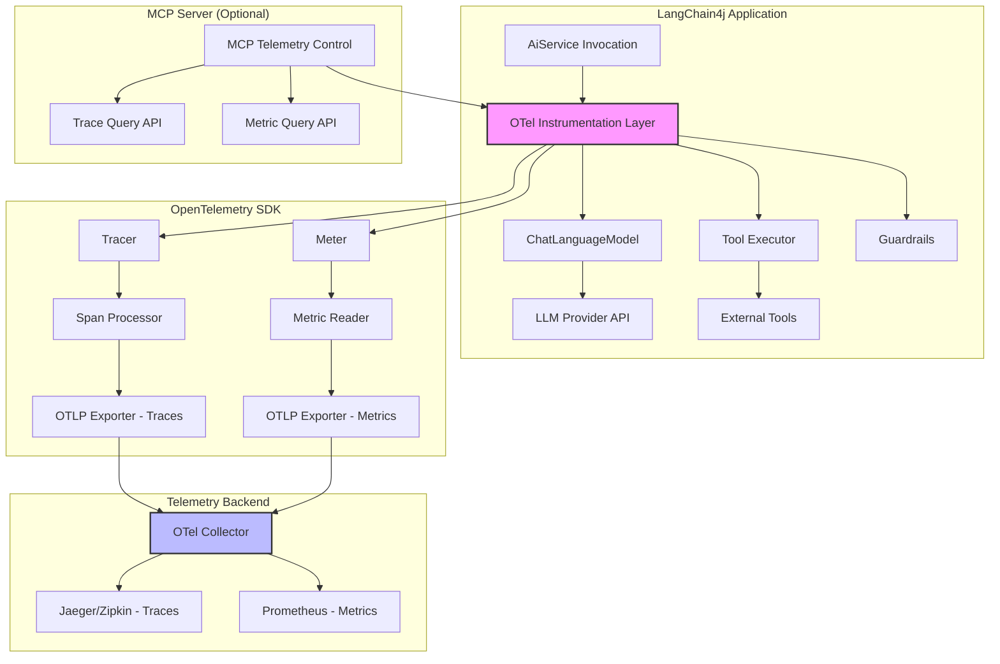

# Add OpenTelemetry - Product Requirements Document

## Executive Summary

### Problem Statement
LangChain4j currently lacks first-class OpenTelemetry (OTel) instrumentation, limiting users' ability to observe, monitor, and debug AI application behavior in production environments. As AI applications scale and become mission-critical, teams need standardized observability that integrates seamlessly with existing monitoring infrastructure.

### Proposed Solution
Introduce a new opt-in module `langchain4j-opentelemetry` that provides comprehensive OpenTelemetry instrumentation for LangChain4j applications. This module will support both OTel Agent and SDK-based configurations, emit traces and metrics following GenAI semantic conventions, and include privacy-first defaults with configurable content capture controls.

### Expected Impact
- **For Users**: Production-grade observability enabling rapid debugging, performance optimization, and cost tracking (token usage) across AI service invocations
- **For LangChain4j Ecosystem**: Alignment with industry-standard observability practices, increased adoption in enterprise environments requiring compliance and auditability
- **For Business**: Reduced time-to-resolution for production issues, improved cost visibility, and enhanced customer confidence in production readiness

### Success Metrics
- Adoption: 20%+ of active LangChain4j users enable OTel instrumentation within 6 months
- Performance: P95 overhead remains under target threshold in production workloads
- Integration: Successful validation with at least 3 major OTel backends (Jaeger, Zipkin, via OTLP)
- Community: 90%+ positive sentiment in user feedback on ease of setup and value delivered

## Requirements & Scope

### Functional Requirements

**REQ-1**: Opt-in Module Architecture
- Provide `langchain4j-opentelemetry` as a separate Maven/Gradle module
- Zero impact on existing applications until explicitly added as dependency
- No breaking changes to core LangChain4j APIs

**REQ-2**: OpenTelemetry SDK Configuration
- Support OTel Java Agent instrumentation (automatic)
- Support OTel SDK Autoconfigure for programmatic setup
- Default to OTLP exporter protocol
- Respect standard `OTEL_*` environment variables (service name, endpoint, headers, etc.)

**REQ-3**: Distributed Tracing Implementation
- Emit root span for each `AiService` invocation (entrypoint)
- Emit child spans for:
  - LLM API calls (e.g., ChatLanguageModel.generate)
  - Tool/function executions
  - Guardrail evaluations (input/output filters)
- Use CLIENT span kind for external LLM API calls
- Follow GenAI semantic conventions (model name, prompt tokens, completion tokens, temperature, etc.)
- Propagate trace context across async boundaries and distributed calls
- Support optional streaming events for real-time observability of token generation

**REQ-4**: Metrics Collection
- Request count (total invocations per service/model)
- Latency histograms (P50, P90, P95, P99 for LLM calls, tool calls, end-to-end)
- Error rate (HTTP errors, timeout errors, validation errors)
- Retry attempts (count and reasons)
- Token usage (prompt tokens, completion tokens, total tokens per request and aggregated)

**REQ-5**: Privacy & Performance Controls
- **Privacy-first defaults**:
  - Redact prompt and completion content by default in spans/logs
  - Provide opt-in flag `otel.instrumentation.langchain4j.capture-content=true` to enable content capture
  - Support configurable truncation limits (e.g., max 1000 chars per prompt/completion)
- **Performance optimization**:
  - Asynchronous batch export of telemetry data
  - Support head sampling (default 10% in production environments)
  - Support tail sampling via OTel Collector integration
  - Target P95 overhead threshold in production workloads

**REQ-6**: Framework Integration Starters
- Provide Spring Boot starter (`langchain4j-opentelemetry-spring-boot-starter`)
- Provide Quarkus extension (`langchain4j-opentelemetry-quarkus`)
- Auto-configuration for both frameworks with sensible defaults

**REQ-7**: Documentation & Samples
- Comprehensive setup guide aligned with `/docs/tutorials/observability.md`
- Sample applications demonstrating:
  - Spring Boot + OTel Agent + OTLP export to Jaeger
  - Quarkus + OTel SDK Autoconfigure + OTLP export to Zipkin
  - Privacy controls and content capture configuration
  - Custom sampling strategies
- Integration guide for major OTel backends (OTLP-based)

**REQ-8**: MCP Server for Telemetry Control
- Develop Model Context Protocol (MCP) server wrapper to:
  - Toggle telemetry on/off at runtime for development/debugging
  - Fetch recent traces (last N spans with filtering)
  - Query recent metrics (time-series data for dashboards)
- Support both development and production use cases (see open question on production support)

### Non-Functional Requirements

**NFR-1**: Java Compatibility
- Target Java 17+ (aligned with LangChain4j baseline)
- No use of Java 21+ features to maintain broader compatibility

**NFR-2**: OpenTelemetry SDK Version
- Require OpenTelemetry Java SDK 1.32+ for full semantic convention support and performance optimizations
- Clearly document minimum version in setup guides

**NFR-3**: Performance Overhead
- P95 latency overhead target: configurable based on user feedback (original <5%, user indicates can aim higher)
- Memory overhead: <50MB additional heap for typical workloads
- No blocking I/O on critical path (all telemetry export must be async)

**NFR-4**: Backward Compatibility
- Zero breaking changes to existing LangChain4j APIs
- Instrumentation activated only when module is present and configured
- Graceful degradation if OTel SDK is not available

**NFR-5**: Security & Compliance
- Redaction of sensitive data (API keys, PII) in telemetry by default
- Support for custom redaction rules via configuration
- No telemetry data sent to any endpoint without explicit user configuration

**NFR-6**: Extensibility
- Allow users to register custom span processors for advanced use cases
- Support custom metric instruments for domain-specific observability

### Out of Scope

- **Not included in this release**:
  - Direct Prometheus exporter (OTLP-only via OTel Collector; resolved from feedback)
  - Logging integration (focus on traces and metrics only)
  - Custom UI/dashboard for telemetry visualization (users leverage existing tools)
  - OpenTelemetry instrumentation for client-side JavaScript SDKs
  - Automatic anomaly detection or alerting (users configure in their backends)

### Success Criteria

- **Functional Completeness**: All REQ-1 through REQ-8 implemented and tested
- **Performance Validation**: Overhead meets target threshold in benchmark tests with real LLM providers
- **Integration Testing**: Successful end-to-end validation with Jaeger and Zipkin via OTLP
- **Documentation Quality**: 90%+ of setup guide readers successfully enable OTel without support tickets
- **Community Validation**: At least 3 community contributors provide positive feedback or contributions to the module

## User Stories

### Personas
1. **DevOps Engineer (Maya)**: Responsible for monitoring production AI services, needs visibility into LLM performance and costs
2. **Backend Developer (Alex)**: Building LangChain4j applications, needs to debug slow requests and understand tool execution flow
3. **Platform Engineer (Jordan)**: Maintains shared observability infrastructure (OTel Collector, Jaeger), needs standard instrumentation from all services

### Core Stories

**Story 1**: Enable Basic Tracing for AiService
- **As** Alex (Backend Developer)
- **I want** to see distributed traces for every AiService invocation
- **So that** I can debug slow requests and understand the execution flow from prompt to completion

**Acceptance Criteria**:
```gherkin
Given I have added langchain4j-opentelemetry module to my project
And I have configured OTEL_EXPORTER_OTLP_ENDPOINT
When I invoke an AiService method
Then a root span should be created with service.name attribute
And child spans should be created for LLM calls, tool executions, and guardrails
And all spans should be exported to the configured OTLP endpoint
```
**Traceability**: REQ-1, REQ-2, REQ-3
**Priority**: Must

---

**Story 2**: Monitor Token Usage and Costs
- **As** Maya (DevOps Engineer)
- **I want** to collect metrics on token usage (prompt, completion, total) per model
- **So that** I can track LLM costs and optimize usage patterns

**Acceptance Criteria**:
```gherkin
Given telemetry is enabled with metrics collection
When LLM API calls are made
Then metrics should record gen_ai.client.token.usage with dimensions:
  - gen_ai.request.model
  - gen_ai.token.type (prompt/completion)
And metrics should be exportable via OTLP
And I can visualize token usage trends in Grafana/Prometheus
```
**Traceability**: REQ-4, NFR-3
**Priority**: Must

---

**Story 3**: Control Content Capture for Privacy Compliance
- **As** Maya (DevOps Engineer)
- **I want** to redact prompt and completion content by default in production
- **So that** I comply with privacy regulations while still getting observability

**Acceptance Criteria**:
```gherkin
Given telemetry is enabled with default configuration
When traces are exported
Then prompt and completion content should NOT appear in span attributes
And only metadata (model, token counts, latency) should be present

Given I set otel.instrumentation.langchain4j.capture-content=true
When traces are exported
Then prompt and completion content should be captured
And content should be truncated to configured max length
```
**Traceability**: REQ-5, NFR-5
**Priority**: Must

---

**Story 4**: Quick Setup with Spring Boot Starter
- **As** Alex (Backend Developer)
- **I want** to enable OTel instrumentation by adding a single dependency
- **So that** I can get observability without complex configuration

**Acceptance Criteria**:
```gherkin
Given I have a Spring Boot application using LangChain4j
When I add langchain4j-opentelemetry-spring-boot-starter dependency
And I set spring.otel.exporter.otlp.endpoint in application.properties
Then telemetry should be auto-configured and active
And I should see traces in my configured backend
And no code changes should be required beyond configuration
```
**Traceability**: REQ-6, NFR-4
**Priority**: Must

---

**Story 5**: Control Sampling to Reduce Overhead
- **As** Maya (DevOps Engineer)
- **I want** to configure head sampling at 10% for production traffic
- **So that** I reduce telemetry overhead and costs while maintaining visibility

**Acceptance Criteria**:
```gherkin
Given I configure OTEL_TRACES_SAMPLER=parentbased_traceidratio
And I set OTEL_TRACES_SAMPLER_ARG=0.1
When AI service invocations occur
Then approximately 10% of traces should be sampled and exported
And sampling decision should be consistent across distributed spans
And performance overhead should meet target threshold
```
**Traceability**: REQ-5, NFR-3
**Priority**: Should

---

**Story 6**: Debug with MCP Telemetry Controls
- **As** Alex (Backend Developer)
- **I want** to toggle telemetry on/off and fetch recent traces via MCP
- **So that** I can debug issues interactively without restarting services

**Acceptance Criteria**:
```gherkin
Given MCP server wrapper is running
When I send MCP command to enable telemetry
Then telemetry should be activated without service restart
And I can query recent traces with filters (time range, service name)
And I can query recent metrics (latency, token usage)
```
**Traceability**: REQ-8
**Priority**: Should

**Open Question**: Should MCP-based telemetry controls be development-only, or also production-supported? (User feedback indicates uncertainty)

---

**Story 7**: Integrate with Existing OTel Collector Pipeline
- **As** Jordan (Platform Engineer)
- **I want** LangChain4j telemetry to use standard OTLP export
- **So that** it flows through our existing OTel Collector without custom integration

**Acceptance Criteria**:
```gherkin
Given I have an OTel Collector configured with OTLP receiver
When LangChain4j services export telemetry
Then traces and metrics should arrive at Collector via OTLP/gRPC or OTLP/HTTP
And telemetry should include standard resource attributes (service.name, service.version)
And Collector should route data to Jaeger, Prometheus, etc. without LangChain4j-specific config
```
**Traceability**: REQ-2, REQ-7
**Priority**: Must

## Technical Considerations

### High-Level Technical Approach

The solution leverages OpenTelemetry's instrumentation API to wrap key LangChain4j extension points:

1. **Instrumentation Points**:
   - `AiService` proxy layer: Root span creation via method interception
   - `ChatLanguageModel` implementations: CLIENT spans for LLM API calls
   - `ToolExecutor`: Child spans for tool invocations
   - Guardrail interfaces: Child spans for input/output validation

2. **Integration Architecture**:
   - **Agent-based**: Automatically instruments applications via bytecode manipulation at runtime (requires `-javaagent` JVM flag)
   - **SDK-based**: Programmatic setup using OpenTelemetry SDK Autoconfigure, initialized during application startup
   - **Context Propagation**: Use OTel Context API to propagate trace context across async boundaries (CompletableFuture, reactive streams)

3. **Export Strategy**:
   - Default to OTLP exporter (gRPC or HTTP based on configuration)
   - Batch span processor with configurable delays (default 5s) to reduce network overhead
   - Periodic metric reader with configurable intervals (default 60s)

### Integration Points with Existing Systems

- **LangChain4j Core**: No modifications to core APIs; instrumentation via aspect-oriented wrappers or decorators
- **Spring Boot**: Leverage Spring Boot's auto-configuration and OTel starter integration
- **Quarkus**: Use Quarkus OpenTelemetry extension and CDI for automatic instrumentation
- **OTel Backends**: OTLP-only export ensures compatibility with Jaeger, Zipkin, Prometheus (via Collector), Honeycomb, Datadog, etc.

### Key Technical Constraints

- **Java 17+ Baseline**: Must not use Java 21 features to maintain compatibility with LangChain4j's target audience
- **OpenTelemetry SDK 1.32+**: Required for GenAI semantic conventions and performance improvements (user feedback: confirm if acceptable)
- **No Blocking I/O**: All telemetry export must be asynchronous to avoid impacting LLM request latency
- **Modular Design**: Module must be opt-in with zero runtime impact when not included

### Performance and Scalability Considerations

- **Overhead Target**: P95 latency overhead target is configurable (user indicates can aim higher than original <5%)
- **Sampling**: Default 10% head sampling in production (user feedback: confirm if acceptable)
- **Memory**: Bounded span and metric buffers with automatic flushing to prevent memory leaks
- **Scalability**: Telemetry pipeline scales independently via OTel Collector (no direct backend coupling)

## Design Specification

### Recommended Approach

Implement a **dual-mode instrumentation strategy** that supports both automatic (Agent-based) and manual (SDK-based) instrumentation. Use OpenTelemetry's semantic conventions for GenAI to ensure telemetry data is standardized and portable across backends. Prioritize privacy-first defaults with opt-in content capture to balance observability value with compliance requirements.

### Key Technical Decisions

#### 1. Instrumentation Method
- **Options Considered**:
  - Pure OTel Agent (bytecode instrumentation only)
  - Pure SDK (programmatic instrumentation only)
  - Hybrid approach (support both Agent and SDK)

- **Tradeoffs**:
  - Agent-only: Zero code changes but requires JVM flag and may conflict with other agents; limited customization
  - SDK-only: Full control and customization but requires code changes and manual setup
  - Hybrid: Best of both worlds but increases maintenance complexity

- **Recommendation**: **Hybrid approach**. Supports enterprise users requiring zero-code instrumentation via Agent, while enabling advanced users to customize via SDK. This aligns with OpenTelemetry's recommended practices and maximizes adoption.

#### 2. Semantic Conventions
- **Options Considered**:
  - Custom LangChain4j-specific attributes
  - OpenTelemetry GenAI semantic conventions (experimental)
  - Generic HTTP/RPC semantic conventions

- **Tradeoffs**:
  - Custom: Full flexibility but creates vendor lock-in and fragmentation
  - GenAI semconv: Standardized but experimental (may change before stable)
  - Generic: Stable but loses AI-specific context (model, tokens, etc.)

- **Recommendation**: **GenAI semantic conventions**. Despite experimental status, these conventions are gaining industry adoption and provide essential AI observability context. Document potential changes and provide migration path if conventions evolve.

#### 3. Content Capture Strategy
- **Options Considered**:
  - Always capture (opt-out)
  - Never capture
  - Privacy-first (opt-in with redaction by default)

- **Tradeoffs**:
  - Always capture: Maximum debugging value but privacy/compliance risk
  - Never capture: Safe but limits debugging capability
  - Opt-in: Balances privacy and utility but requires user awareness

- **Recommendation**: **Privacy-first with opt-in content capture**. Redact prompts/completions by default, provide clear opt-in flag with truncation limits. This aligns with GDPR/CCPA requirements while enabling debugging when explicitly authorized.

#### 4. Sampling Strategy
- **Options Considered**:
  - No sampling (100% trace export)
  - Head sampling only
  - Tail sampling via OTel Collector
  - Adaptive sampling

- **Tradeoffs**:
  - No sampling: Complete visibility but high cost and overhead
  - Head sampling: Simple and low overhead but may miss important traces
  - Tail sampling: Intelligent (sample errors/slow requests) but requires Collector setup
  - Adaptive: Optimal but complex to implement and tune

- **Recommendation**: **Default head sampling with tail sampling support**. Provide 10% head sampling default (user feedback: confirm acceptability) for cost control, document tail sampling configuration via Collector for production use cases requiring higher fidelity on errors.

#### 5. Metrics Implementation
- **Options Considered**:
  - OpenTelemetry Metrics SDK
  - Micrometer with OTel bridge
  - Custom metrics implementation

- **Tradeoffs**:
  - OTel SDK: Native integration but requires users to adopt OTel metrics pipeline
  - Micrometer: Familiar to Spring users but adds dependency and translation overhead
  - Custom: Full control but reinventing the wheel

- **Recommendation**: **OpenTelemetry Metrics SDK**. Native support ensures consistency with traces, leverages OTel's OTLP export, and aligns with industry-standard observability stack.

#### 6. Dedicated LangChain4j OTel Agent Instrumentation
- **Options Considered**:
  - Develop dedicated OTel Agent extension for LangChain4j
  - Rely on generic Java instrumentation + SDK configuration

- **Tradeoffs**:
  - Dedicated extension: Optimal zero-code experience but requires OTel Java Instrumentation contribution and maintenance
  - Generic + SDK: Faster to market but requires minimal configuration code

- **Recommendation**: **Start with SDK-based approach, evaluate dedicated Agent extension post-GA**. This accelerates time-to-market while gathering user feedback on instrumentation patterns. If demand justifies, contribute LangChain4j extension to OpenTelemetry Java Instrumentation project.

**Open Question from Feedback**: Do you expect a dedicated OTel Agent instrumentation for LangChain4j? (Recommendation above suggests starting without, but can prioritize if critical to your use case)

### High-Level Architecture



### Key Considerations

- **Performance**: Asynchronous batch export with 5s default delay ensures telemetry overhead is minimal (target: P95 latency increase configurable per user feedback). Sampling strategies (10% default) further reduce production impact. Memory-bounded buffers prevent leaks during traffic spikes.

- **Security**: All sensitive data (prompts, completions, API keys) redacted by default. Opt-in content capture requires explicit configuration flag. No telemetry data sent to external endpoints without user-configured OTLP target. Support for custom redaction rules via span processor hooks.

- **Scalability**: OTLP export decouples LangChain4j applications from backend-specific protocols. OTel Collector acts as aggregation layer, enabling horizontal scaling and backend flexibility. Metric aggregation happens in Collector, reducing per-application memory overhead.

### Risk Management

- **Technical Risk 1 - OTel SDK Version Compatibility**: OpenTelemetry Java SDK 1.32+ is required for GenAI semantic conventions. Older SDK versions may be in use by enterprises with strict dependency management. **Mitigation**: Clearly document minimum version in setup guide, provide compatibility matrix, and test with SDK 1.32-1.35 to ensure forward compatibility.

- **Technical Risk 2 - Performance Overhead in High-Throughput Scenarios**: Streaming LLM responses may generate high-frequency span events, causing overhead. **Mitigation**: Make streaming events opt-in (default off), implement adaptive batching for event export, and provide clear benchmarks for users to tune sampling rates.

- **Technical Risk 3 - Context Propagation in Async Flows**: LangChain4j uses CompletableFuture and reactive streams extensively. Trace context may be lost across async boundaries. **Mitigation**: Use OTel Context API's `Context.wrap()` for executors, test with reactive libraries (Reactor, RxJava), and document best practices for custom async patterns.

- **Technical Risk 4 - GenAI Semantic Conventions Instability**: OpenTelemetry GenAI conventions are experimental and may change. **Mitigation**: Version-lock semantic convention dependency, monitor OTel specification changes, and provide migration guide if breaking changes occur. Consider abstracting attribute names behind internal constants for easier updates.

### Success Criteria

- **Functional**: All trace and metric requirements (REQ-3, REQ-4) validated with Jaeger and Zipkin via OTLP
- **Performance**: P95 overhead remains under configured target in benchmark with OpenAI/Anthropic providers at 100 req/s
- **Privacy**: Default configuration passes security audit with no sensitive data in exported telemetry
- **Usability**: Spring Boot and Quarkus starters enable observability with <5 lines of configuration

## Dependencies & Assumptions

### External Dependencies

- **OpenTelemetry Java SDK 1.32+**: Required for GenAI semantic conventions and performance optimizations (user feedback: confirm acceptability)
- **LangChain4j Core 0.x**: Module must align with current LangChain4j API contracts
- **Spring Boot 3.x / Quarkus 3.x**: For framework starter implementations
- **OTel Collector (Optional)**: Required for tail sampling and advanced routing (not mandatory for basic usage)

### Assumptions

- **LangChain4j API Stability**: Core `AiService`, `ChatLanguageModel`, and tool execution interfaces remain stable during development
- **OTLP Adoption**: Users have access to OTLP-compatible backends or can deploy OTel Collector (no direct Prometheus export per resolved feedback)
- **Java 17+ Runtime**: Target audience uses Java 17 or later (no Java 8 support required)
- **Development Resources**: Team has expertise in OpenTelemetry instrumentation and LangChain4j internals
- **MCP Use Case Clarity**: MCP server wrapper design may need refinement based on open feedback question about production vs. development support

### Cross-Team Coordination Needs

- **LangChain4j Core Team**: Coordinate on instrumentation points, ensure no API breaking changes
- **Documentation Team**: Align with existing `/docs/tutorials/observability.md` structure
- **Community**: Gather feedback on semantic conventions and sampling defaults before GA release

## Risk Assessment

### Technical Risks

**Risk 1 - GenAI Semantic Conventions Breaking Changes**
- **Impact**: Medium - Attribute names or structure may change, requiring users to update queries/dashboards
- **Likelihood**: Medium - Conventions are experimental (not stable)
- **Mitigation**:
  - Version-lock semantic convention library
  - Abstract attribute names behind constants for easier updates
  - Provide migration guide and backward compatibility shim for one major version
  - Monitor OpenTelemetry specification repository for proposed changes

**Risk 2 - Performance Degradation in Streaming Scenarios**
- **Impact**: High - High-frequency span events during streaming could cause unacceptable overhead
- **Likelihood**: Medium - Depends on token generation rate and event granularity
- **Mitigation**:
  - Make streaming events opt-in (disabled by default)
  - Implement adaptive batching (buffer events and flush periodically)
  - Provide performance benchmarks for different configurations
  - Document recommended settings for high-throughput production use

**Risk 3 - Context Propagation Failures in Async Code**
- **Impact**: High - Broken trace context leads to disconnected spans and poor observability
- **Likelihood**: Medium - LangChain4j uses async extensively with various patterns
- **Mitigation**:
  - Comprehensive testing with CompletableFuture, reactive streams (Reactor, RxJava)
  - Use OTel's `Context.taskWrapping()` for executor services
  - Provide helper utilities for custom async patterns
  - Document context propagation best practices in setup guide

### User Experience Risks

**Risk 1 - Complex Configuration for Edge Cases**
- **Impact**: Medium - Advanced users may struggle with custom sampling, redaction, or MCP setup
- **Likelihood**: Medium - Not all use cases covered by defaults
- **Mitigation**:
  - Provide comprehensive examples for common advanced scenarios
  - Offer "configuration recipes" (copy-paste YAML/properties for specific backends)
  - Active community support and FAQ based on early adopter feedback

**Risk 2 - Privacy Misconceptions**
- **Impact**: High - Users may unknowingly export sensitive data if they misunderstand opt-in controls
- **Likelihood**: Low-Medium - Clear defaults help, but configuration mistakes happen
- **Mitigation**:
  - Prominent documentation warnings about content capture risks
  - Log warning message on startup when content capture is enabled
  - Provide audit mode (dry-run) to preview telemetry data before export

**Risk 3 - Backend Compatibility Issues**
- **Impact**: Medium - Some backends may have quirks with OTLP or GenAI attributes
- **Likelihood**: Low - OTLP is well-supported, but edge cases exist
- **Mitigation**:
  - Test with major backends (Jaeger, Zipkin, Honeycomb, Datadog) during beta
  - Document known limitations or workarounds
  - Provide troubleshooting guide for common export issues

## Appendices

### Appendix A: OpenTelemetry GenAI Semantic Conventions Reference

Key attributes to be implemented (based on OTel GenAI spec):

**Trace Attributes:**
- `gen_ai.system` (e.g., "openai", "anthropic")
- `gen_ai.request.model` (e.g., "gpt-4", "claude-3")
- `gen_ai.request.temperature`
- `gen_ai.request.max_tokens`
- `gen_ai.response.finish_reason`
- `gen_ai.usage.prompt_tokens`
- `gen_ai.usage.completion_tokens`

**Metric Instruments:**
- `gen_ai.client.request.duration` (Histogram)
- `gen_ai.client.token.usage` (Counter)
- `gen_ai.client.error.count` (Counter)

### Appendix B: Integration Examples

**Spring Boot Minimal Setup:**
```yaml
# application.yml
spring:
  application:
    name: my-langchain4j-app
  otel:
    exporter:
      otlp:
        endpoint: http://localhost:4318
    traces:
      sampler:
        probability: 0.1

langchain4j:
  otel:
    capture-content: false  # Privacy-first default
```

**Quarkus Minimal Setup:**
```properties
# application.properties
quarkus.application.name=my-langchain4j-app
quarkus.otel.exporter.otlp.endpoint=http://localhost:4318
quarkus.otel.traces.sampler=parentbased_traceidratio
quarkus.otel.traces.sampler.arg=0.1

langchain4j.otel.capture-content=false
```

### Appendix C: Open Questions Summary

The following questions remain open from user feedback and should be resolved before finalization:

1. **P95 Overhead Target**: User indicated "can aim for higher" than <5%. What is the acceptable overhead threshold? (Recommendation: 10% for P95, 5% for P50)

2. **MCP Production Support**: Should MCP-based telemetry controls be development-only, or also production-supported? (Impacts MCP server design and security considerations)

3. **OpenTelemetry Java SDK 1.32+ Requirement**: Is this minimum version acceptable? (Alternative: Support SDK 1.28+ with conditional GenAI convention usage)

4. **Default 10% Head Sampling**: Is this acceptable for production? (Alternative: 5% default with documentation to increase)

5. **Dedicated OTel Agent Instrumentation**: Do you expect a dedicated OTel Agent instrumentation for LangChain4j? (Impacts roadmap and zero-code experience)

### Appendix D: Reference Links

- **LangChain4j Repository**: https://github.com/langchain4j/langchain4j
- **Existing Observability Docs**: `/docs/tutorials/observability.md` (to be aligned with this PRD)
- **OpenTelemetry GenAI Semantic Conventions**: https://opentelemetry.io/docs/specs/semconv/gen-ai/
- **OpenTelemetry Java SDK**: https://github.com/open-telemetry/opentelemetry-java
- **OTLP Specification**: https://opentelemetry.io/docs/specs/otlp/

---

**Document Version**: 2.0
**Last Updated**: 2025-10-28
**Status**: Draft - Awaiting Resolution of Open Questions
