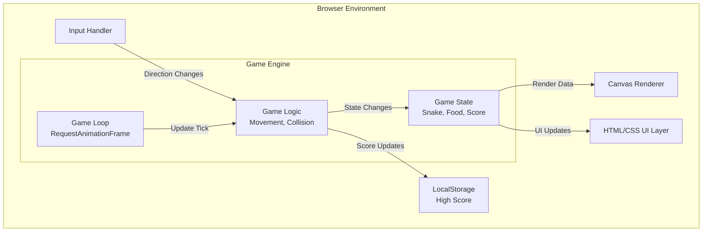

# Snake Game Challenge - Product Requirements Document

## Executive Summary

### Problem Statement
Users need an engaging, classic Snake game experience that can be played directly in a web browser without installation or complex setup. The game should provide entertainment value while demonstrating clean game development practices.

### Proposed Solution
Develop a browser-based Snake game implementing the classic gameplay mechanics where players control a snake that grows longer as it consumes food, while avoiding collisions with walls and itself. The game will feature intuitive controls, visual feedback, and score tracking to create an engaging user experience.

### Expected Impact
- **User Value**: Provides an accessible, nostalgic gaming experience that can be enjoyed during breaks or leisure time
- **Educational Value**: Demonstrates fundamental game development concepts including game loops, collision detection, and state management
- **Accessibility**: Zero-installation, browser-based gameplay accessible across devices

### Success Metrics
- Game loads and becomes playable within 2 seconds
- Smooth gameplay at consistent 60 FPS on standard hardware
- Intuitive controls with response time under 100ms
- Score persistence across game sessions

---

## Requirements & Scope

### Functional Requirements

| ID | Requirement | Priority |
|----|-------------|----------|
| REQ-1 | The game shall display a rectangular game board with clearly defined boundaries | Must |
| REQ-2 | The snake shall be represented as a series of connected segments moving across the board | Must |
| REQ-3 | The player shall control the snake's direction using arrow keys (Up, Down, Left, Right) | Must |
| REQ-4 | Food items shall appear at random positions on the game board | Must |
| REQ-5 | The snake shall grow by one segment when it consumes food | Must |
| REQ-6 | The game shall end when the snake collides with the wall boundaries | Must |
| REQ-7 | The game shall end when the snake collides with its own body | Must |
| REQ-8 | The current score shall be displayed and updated in real-time | Must |
| REQ-9 | The game shall provide a start/restart mechanism | Must |
| REQ-10 | The game shall display a "Game Over" screen with final score when the game ends | Must |
| REQ-11 | The snake's movement speed shall increase progressively as the score increases | Should |
| REQ-12 | The highest score shall be persisted and displayed across sessions | Should |
| REQ-13 | The game shall support WASD keys as alternative controls | Should |
| REQ-14 | The game shall provide visual feedback when food is consumed | Could |
| REQ-15 | The game shall include a pause/resume functionality | Could |

### Non-Functional Requirements

| ID | Requirement | Priority |
|----|-------------|----------|
| NFR-1 | The game shall render at a minimum of 60 frames per second on standard hardware | Must |
| NFR-2 | Control input shall be processed within 100ms of user action | Must |
| NFR-3 | The game shall be playable on modern browsers (Chrome, Firefox, Safari, Edge - latest 2 versions) | Must |
| NFR-4 | The game shall be responsive and playable on screens 320px wide and above | Must |
| NFR-5 | The game shall function without requiring any backend server | Must |
| NFR-6 | The codebase shall be maintainable with clear separation of game logic and rendering | Should |
| NFR-7 | The game shall load completely within 2 seconds on a standard broadband connection | Should |

### Out of Scope
- Multiplayer functionality
- Mobile touch controls (beyond basic tap-to-start)
- Sound effects and background music
- User accounts and online leaderboards
- Multiple game modes or difficulty settings
- Power-ups and special food items
- Custom themes or snake skins

### Success Criteria
1. All "Must" priority requirements are fully implemented and functional
2. Game can be played from start to game-over without crashes or visual glitches
3. Score tracking works correctly (increments on food consumption, persists high score)
4. Controls are responsive and the snake moves in the expected direction
5. Collision detection accurately identifies wall and self-collisions

---

## User Stories

### Personas
- **Casual Player**: Someone looking for quick entertainment during a break
- **Nostalgic Gamer**: Someone familiar with the classic Snake game seeking a familiar experience

### Core User Stories

#### Story 1: Start a New Game
**As a** casual player
**I want to** easily start a new game
**So that** I can begin playing without complicated setup

**Acceptance Criteria:**
```gherkin
Given the game page has loaded
When I click the start button or press a key
Then the game should begin with a snake of initial length
And a food item should appear on the board
```
**Priority:** Must
**Traceability:** REQ-1, REQ-2, REQ-4, REQ-9

#### Story 2: Control the Snake
**As a** casual player
**I want to** control the snake's direction using keyboard keys
**So that** I can navigate towards food and avoid obstacles

**Acceptance Criteria:**
```gherkin
Given the game is in progress
When I press an arrow key (or WASD key)
Then the snake should change direction accordingly
And the snake should not be able to reverse directly into itself
```
**Priority:** Must
**Traceability:** REQ-3, REQ-13, NFR-2

#### Story 3: Consume Food and Grow
**As a** casual player
**I want to** see my snake grow when it eats food
**So that** I feel a sense of progression and achievement

**Acceptance Criteria:**
```gherkin
Given the game is in progress
When the snake's head reaches the food position
Then the snake should grow by one segment
And the score should increase
And a new food item should appear at a random location
```
**Priority:** Must
**Traceability:** REQ-4, REQ-5, REQ-8, REQ-14

#### Story 4: Game Over on Collision
**As a** casual player
**I want to** receive clear feedback when I lose
**So that** I understand why the game ended

**Acceptance Criteria:**
```gherkin
Given the game is in progress
When the snake collides with a wall
Then the game should end
And a Game Over screen should display with my final score

Given the game is in progress
When the snake collides with its own body
Then the game should end
And a Game Over screen should display with my final score
```
**Priority:** Must
**Traceability:** REQ-6, REQ-7, REQ-10

#### Story 5: View and Beat High Score
**As a** nostalgic gamer
**I want to** see my high score and try to beat it
**So that** I have motivation to replay

**Acceptance Criteria:**
```gherkin
Given I have played the game before
When the game loads
Then my previous high score should be displayed

Given I finish a game with a score higher than my previous best
When the Game Over screen appears
Then my new high score should be saved and displayed
```
**Priority:** Should
**Traceability:** REQ-8, REQ-12

#### Story 6: Increasing Challenge
**As a** casual player
**I want to** experience increasing difficulty as I progress
**So that** the game remains challenging and engaging

**Acceptance Criteria:**
```gherkin
Given I am playing the game
When my score increases past certain thresholds
Then the snake's movement speed should increase slightly
And the game should remain playable at the new speed
```
**Priority:** Should
**Traceability:** REQ-11, NFR-1

---

## User Experience & Interface

### User Journey
1. **Landing**: User opens the game in a browser and sees the game board with a "Press any key to start" prompt
2. **Playing**: User controls the snake, collects food, watches score increase
3. **Challenge**: As score increases, snake speeds up, creating tension
4. **Game Over**: Collision occurs, game over screen shows final score and high score
5. **Replay**: User can immediately start a new game

### Interface Requirements
- **Game Board**: Centered rectangular area with visible boundaries
- **Snake**: Distinctive color, clearly segmented body
- **Food**: Contrasting color, easily visible against the board
- **Score Display**: Current score prominently shown above or beside the game board
- **High Score Display**: Best score shown for reference
- **Game State Indicators**: Clear visual states for "Ready", "Playing", "Paused", "Game Over"

### Accessibility Considerations
- High contrast colors for snake, food, and boundaries
- Keyboard-only operation (no mouse required for gameplay)
- Clear visual feedback for all game events
- Text elements sized appropriately for readability

---

## Technical Considerations

### High-Level Technical Approach
The game will be implemented as a single-page web application using HTML5 Canvas for rendering and vanilla JavaScript for game logic. This approach ensures:
- No framework dependencies for simple, fast loading
- Canvas API provides efficient 2D game rendering
- Local Storage API enables score persistence
- Single HTML file deployment capability

### Integration Points
- **Browser APIs**: HTML5 Canvas, Local Storage, RequestAnimationFrame
- **No external dependencies**: Self-contained implementation

### Key Technical Constraints
- Must work without server-side components
- Must support keyboard input handling
- Must manage game state (running, paused, game over)
- Must implement collision detection for walls and self-intersection

### Performance Considerations
- Use RequestAnimationFrame for smooth animation
- Efficient collision detection (only check head against body/walls)
- Minimal DOM manipulation during gameplay
- Optimized canvas redraw (clear and redraw only necessary elements)

---

## Design Specification

### Recommended Approach
Implement a lightweight, vanilla JavaScript Snake game using HTML5 Canvas for rendering, with a clear separation between game state management and visual rendering.

### Key Technical Decisions

#### 1. Rendering Technology
- **Options Considered**: HTML5 Canvas, SVG, DOM elements with CSS
- **Tradeoffs**: Canvas offers best performance for frequent redraws but requires manual hit detection; SVG provides scalability but slower for many moving elements; DOM/CSS is simplest but poorest performance for games
- **Recommendation**: HTML5 Canvas - provides optimal balance of performance and simplicity for a grid-based game with frequent updates

#### 2. Game Loop Implementation
- **Options Considered**: setInterval, setTimeout, RequestAnimationFrame
- **Tradeoffs**: setInterval/setTimeout provide consistent timing but can drift and don't sync with display; RAF syncs with display refresh for smooth animation but requires manual timing control
- **Recommendation**: RequestAnimationFrame with delta-time accumulator - ensures smooth 60 FPS rendering while maintaining consistent game speed

#### 3. State Management
- **Options Considered**: Global variables, Single state object, State machine pattern
- **Tradeoffs**: Globals are simple but hard to maintain; single object organizes state but can grow complex; state machine adds structure but more code
- **Recommendation**: Single state object with state machine for game phases - balances organization with simplicity for a game of this scope

#### 4. Data Persistence
- **Options Considered**: Cookies, LocalStorage, IndexedDB
- **Tradeoffs**: Cookies have size limits and are sent with requests; LocalStorage is simple and synchronous; IndexedDB is powerful but overkill for simple data
- **Recommendation**: LocalStorage - perfect fit for persisting a single high score value with simple synchronous API

### High-Level Architecture



### Key Considerations
- **Performance**: Canvas rendering with RAF ensures smooth 60 FPS; collision detection limited to head-only checks minimizes computation per frame
- **Security**: No external data input; LocalStorage for trusted score data only; no eval or dynamic code execution
- **Scalability**: Modular design allows easy addition of features like multiple food types or game modes

### Risk Management
- **Browser Compatibility Risk**: Different browsers may handle Canvas or keyboard events differently; mitigate by using well-supported APIs and testing across major browsers
- **Performance on Low-End Devices Risk**: Complex snake bodies or high speeds may cause frame drops; mitigate by optimizing render loop and limiting maximum snake length if needed

### Success Criteria
- Game runs at stable 60 FPS throughout gameplay
- All collision detection is accurate with no false positives/negatives
- High score persists correctly across browser sessions
- Controls feel responsive with no perceivable input lag

---

## Dependencies & Assumptions

### Dependencies
- Modern web browser with HTML5 Canvas support
- JavaScript enabled in user's browser
- LocalStorage available and not blocked

### Assumptions
- Users have access to a physical keyboard for controls
- Users are playing on desktop/laptop devices primarily
- Screen resolution is at least 320px wide
- Browser supports ES6+ JavaScript features

---

## Appendices

### Reference: Classic Snake Game Mechanics
The classic Snake game follows these core mechanics:
- Snake moves continuously in the current direction
- Player can only change direction, not stop movement
- 180-degree turns (reversing) are not allowed
- Food spawns at random empty grid positions
- One food item visible at a time
- Snake grows from the tail when eating
- Game speed typically increases with length/score
